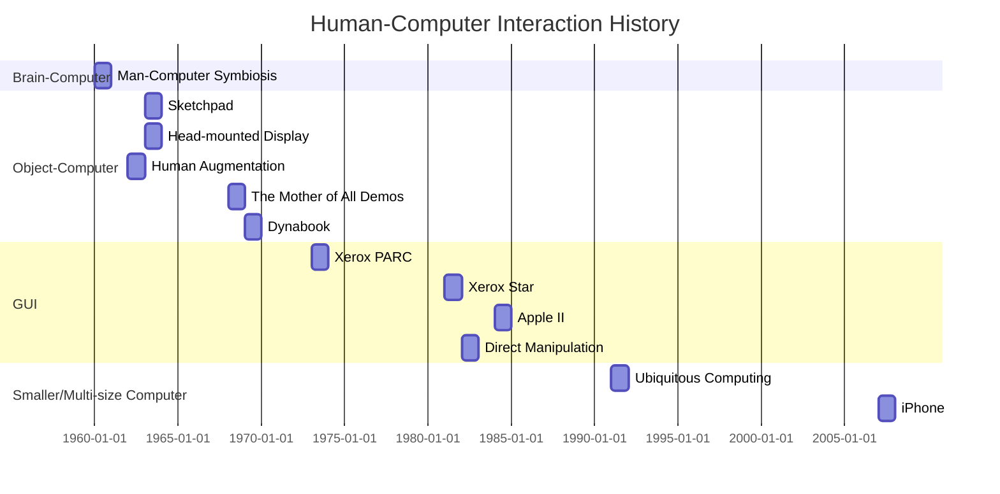

# 【互動科技研究討論】0 Introduction

> **閱讀資料**
> - [The HCI Innovator's Dilemma](https://interactions.acm.org/archive/view/november-december-2018/the-hci-innovators-dilemma) [name=Chis Harrison] [time=2018]
> 
> 
> [color=#6b26ff]

### HCI 發展歷史

| Computer                | Developer             | Time | Note                    |
| ----------------------- | --------------------- | ---- | ----------------------- |
| ENIAC                   |                       | 1946 |                         |
| Memex                   | Vannervar Bush[^1]    | 1945 |                         |
| Man-Computer Symbiosis  | J. C. R. Licklider    | 1960 |                         |
| Sketchpad               | Ivan Sutherland       | 1963 |                         |
| Head-mounted Display    | Ivan Sutherland       | 1963 |                         |
| Human Augmentation      | Douglas Engelbart[^2] | 1962 |                         |
| The Mother of All Demos |                       | 1968 |                         |
| Dynabook                | Alan Kay              | 1969 | laptop                  |
| Xerox Alto              |                       |      | GUI                     |
| Xerox Star              |                       | 1981 |                         |
| Apple II[^3]            |                       | 1984 | first business computer |
| Direct manipulation     | Ben Shneiderman       | 1982 |                         |
| Ubiquitous Computing    | Mark Weiser[^4]       | 1991 |                         |
| iPhone                  |                       | 2007 |                         |

[^1]: Concept of hyperlink and world wide web As We May Think. Life, 1945.
[^2]: Augmenting Human Intellect: A Conceptual Framework, 1962.
[^3]: Time Magazine, 1983 Person of the Year
[^4]: The Computer for the 21st Century. Scientific American, 1991.

### 創新的兩難 The HCI Innovator's Diemma[^5]
- 文章切入點：HCI 的技術發展，與創新循環的生命週期並不相搭
- takeways:
    - Innovations is the essence of an HCI professional's life, as we are all inventors and problem solvers.
    - It is important to consider the lifecycle of HCI ideas and where we can maximize our intellectual impact.

- Technology Lifecycle S-Curve 可視為 HCI 產品的影響力曲線圖，越多人用、影響就越大。而在 HCI 的發明者，都渴望為人類社會帶來影響：intellectual impact。
- 達克效應 Dunning-Kruger effect 愚昧山丘

[^5]:The HCI Innovator's Diemma [PDF](https://dl.acm.org/doi/10.1145/3274564), [Web](https://interactions.acm.org/archive/view/november-december-2018/the-hci-innovators-dilemma)

### HCI 研究流程 Research Flow
1. Motivation drives(novel solution) :arrow_right: Idea :arrow_left: Technique drives(scenarios, killing application)
2. compare ideas with state-of-the-art works
3. Storytelling in the best case
    - convince yourself
    - discuss with others
4. enable interactions：prototyping
5. user study（透過實驗驗證效果）

A HCI researcher need to be: Dreaming, Storyteling, Making
- Makeing
    - searching
    - learning
- Dreaming
    - Observation
    - Inspiration
    - Brainstorming
- Storytelling

### 重點 HCI 論壇／年會／研討會

#### 學術型研討會

前三者最大、paper 被接受的困難度最高

- [UIST 2020](https://uist.acm.org/uist2020/)
- [CHI 2020](https://chi2020.acm.org)
- [CSCW 2020](https://cscw.acm.org/2020/)
- UBICOMP 2020
    > 以 ubiqutous computing 為主，因此較多穿戴式裝置、攜帶型裝置的題目。
- MobileHCI 2020
- VRST 2020
- IEEE VR 2020
- TAICHI'19
    > 台灣國內自己創立的互動學會

#### 年會
- OpenHCI 人機互動工作坊
- Mix 創新設計年會
- 

不知道要什麼 paper 嗎？ RANDOM HCI paper

### 課程要求
- 03/06(五) 會有個 Workshop
- 6 次作業
- 評分標準
    - proposal 20%
    - final presentation 20%
    - final report 20%
    - participation 20%
    - assignment 20%

### Homework
自我介紹（做成 slide）
- 背景、興趣、能力、做過的專案
- 畫圖：想像未來世界的互動
- 5 分鐘介紹 + 3 分鐘 QA

> ### The best way to predict the future is to invent it.  -Alan Kay
> ### The best way to start inventing the future is to read papers.
> [color=#6b26ff]

---

###### tags: `NCCU` `互動科技研究討論`
> 2020 年政治大學數位內容[【互動科技研究討論】](https://hackmd.io/@laiyenju/NCCU-1082-interaction)課程筆記
> 
> 週二 14:00-17:00｜授課老師：蔡欣叡
